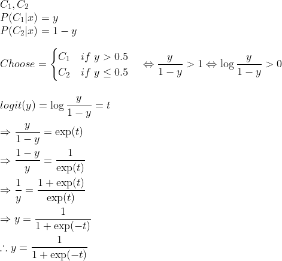
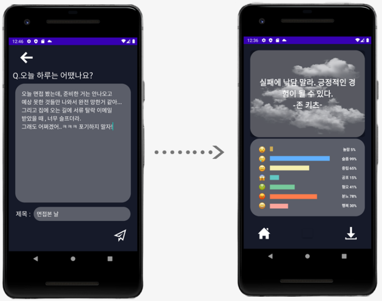

# ML

<!-- code_chunk_output -->

- [KoBERT with Huggingface](#kobert-with-huggingface)
- [Requirements](#requirements)
- [How to install](#how-to-install)
- [Data](#data)
- [Result](#result)
- [Reference](#reference)

<!-- /code_chunk_output -->

---

## KoBERT with Huggingface

Huggingface 기반 KoBERT를 사용하여 텍스트 감정 분석을 진행하였습니다.

## Requirements

- python==3.9.2
- mxnet==1.7.0.post2
- gluonnlp==0.10.0
- pandas==1.2.5
- sentencepiece==0.1.96
- transformers==4.2.2
- torch==1.11.0

## How to install

### in colab

```python
!pip install "git+https://github.com/SKTBrain/KoBERT.git#egg=kobert_tokenizer&subdirectory=kobert_hf"
```

### in vscode

```sh
python -m venv .venv
```

Ctrl+Shift+P</br>
Python:Select Interpreter</br>
Python 3.9.2('.venv':venv)

```sh
pip install --upgrade pip
pip install "git+https://github.com/SKTBrain/KoBERT.git#egg=kobert_tokenizer&subdirectory=kobert_hf"
pip install -r requirements.txt
```

## Data

### Source

1. [AIHub 감정분류를 위한 대화 음성](https://aihub.or.kr/opendata/keti-data/recognition-laguage/KETI-02-002)
   - 기본 : label로 상황 column를 사용
   - 변형 : label로 1~5번 감정세기로 도출된 값을 사용</br>
     (중립은 항상 감정세기가 0이므로 따로 1의 가중치를 줌)</br>
     ('취업'과 관련된 키워드가 부정적인 예시 밖에 없어 '취업'이 포함된 데이터는 삭제)
2. [AIHub 한국어 감정정보 단발성 대화](https://aihub.or.kr/opendata/keti-data/recognition-laguage/KETI-02-009)
   - raw data를 살펴보면 데이터 자체의 신뢰도가 높지 않음(납득이 가지 않는 label이 많음)

### Dataset

| 감정 | data1 | data2 | data3 | data4 | data5 | data6 |
| :--: | :---: | :---: | :---: | :---: | :---: | :---: |
| 행복 | 4548  | 10585 | 4506  | 10538 | 4506  | 6958  |
| 분노 | 11635 | 17300 | 8649  | 14310 | 4324  | 6958  |
| 혐오 | 4660  | 10089 | 2708  | 8134  | 2708  | 6958  |
| 공포 | 4131  | 9599  | 3150  | 8587  | 3150  | 6958  |
| 중립 | 3262  | 8092  | 7029  | 11854 | 4217  | 6958  |
| 슬픔 | 14000 | 19267 | 16864 | 22107 | 4553  | 6958  |
| 놀람 | 1755  | 7653  | 1065  | 6958  | 1065  | 6958  |

## Result

### Accuracy

|  model(data)  |   acc   | data info                                                        |
| :-----------: | :-----: | :--------------------------------------------------------------- |
| model1(data1) | 0.92422 | source1(기본)                                                    |
| model2(data2) | 0.74187 | source1(기본) + source2                                          |
| model3(data3) | 0.76778 | source1(변형)                                                    |
| model4(data4) | 0.65791 | source1(변형) + source2                                          |
| model5(data5) | 0.76473 | data3를 기준으로 under sampling({1:0.5,4:0.6,5:0.28}비율로)      |
| model6(data6) | 0.63665 | data4를 기준으로 under sampling(가장 적은 수의 label을 기준으로) |

### Analysis

- 정확도는 model1이 가장 높지만 실제 테스트에서는 납득이 가지 않는 분석이 더러 있었습니다. raw data를 살펴보면 애초에 라벨링 과정에서 납득이 가지 않는 데이터가 많이 포함되어 있는 것을 발견할 수 있었습니다.
- 주어진 정보(1~5의 감정세기)에 가중치를 주어 계산하여 새로운 값을 도출하여 라벨링을 진행하였습니다.
- 데이터 불균형이 심하여(슬픔 data가 압도적으로 많아 어떤 텍스트를 주어도 슬픔일 확률이 높음) under sampling을 하여 label간의 균형을 맞추어 주었습니다.
- 새로운 데이터 셋으로 학습을 진행한 model은 정확도는 낮아졌지만 실제 테스트 시 사용자의 만족도(납득할 수 있는 분석인가)는 올라갔습니다.
- 최종적으로 model5와 model6 중 하나를 선택해야 했는데 source2가 신뢰도가 낮다고 판단하여 학습데이터에 포함되지 않는 것이 좋다고 판단하였습니다.
- 따라서 최종적으로 model5를 선택하였습니다.
- (추가) model의 정확도를 높일 수 있는 방안으로는 시간이 허락한다면 학습데이터에 대한 labeling을 직접 하여 데이터의 신뢰도를 높이는 것이 될 것 입니다.

### logit to percent(e.g. two classes)

logit을 percent로 변환하는 식입니다. </br>


### In App



---

## Reference

- [KoBERT](https://github.com/SKTBrain/KoBERT)
- [Huggingface Transformers](https://github.com/huggingface/transformers)
- [AIHub](https://aihub.or.kr)
